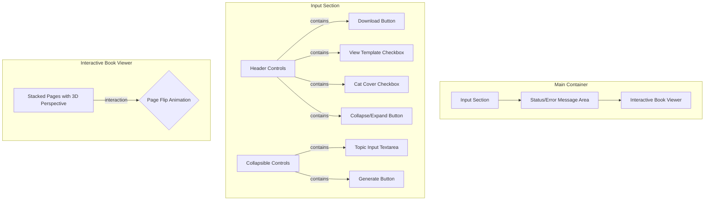

<!-- TINS Specification v1.0 -->
# AI-Powered 10-Chapter Novella Generator

## Description

This is a web-based creative writing assistant that empowers users to generate complete 10-chapter novellas from a single topic idea. The application leverages the Google Gemini AI to draft a story and an accompanying cover image, presenting the final output in an interactive, 3D flippable digital book format.

The core of the application is a structured prompting mechanism based on a proven 10-chapter novella template, ensuring that the generated stories have a coherent plot progression, from the initial hook to the final resolution. Users can interact with the generated book, turn pages with a satisfying animation, and download the full story as a text file for later use. The application also includes developer/debug modes for viewing the base template and testing with a default cover image.

## Functionality

### Core Features

-   **AI Story Generation:** Users can enter any topic, and the application will generate a unique 10-chapter novella based on it.
-   **AI Cover Art Generation:** For each generated story, the application creates a unique, contextually relevant book cover image.
-   **Interactive Book Interface:** The generated story is presented as a stack of pages that the user can flip through with a 3D turning animation.
-   **Text File Download:** Users can download the complete generated story (title and all chapters) as a single `.txt` file.
-   **Collapsible Input UI:** The primary input controls can be collapsed to provide an unobstructed view of the generated book.
-   **Template Viewer Mode:** A debug feature that allows users to view the underlying 10-chapter writing template populated in the book interface, bypassing AI generation.
-   **Debug Cover Mode:** A debug feature that allows users to toggle a default "Cat Cover" image, which overrides any AI-generated cover. This can be applied to both AI-generated stories and the template view.

### User Interface

The application interface is a single-page layout divided into three main sections, designed with a Google Material aesthetic supporting both light and dark themes.



-   **Input Section:** A bordered section at the top.
    -   **Header:** Contains the "Download" button, "View Template" checkbox, "Cat Cover" checkbox, and a "Collapse/Expand" button.
    -   **Collapsible Area:** Contains a multi-line textarea for the story topic and the primary "Generate" button.
-   **Status/Error Message Area:** A dedicated line of text below the input section to display feedback to the user (e.g., "Generating story...", "Story downloaded", or error messages).
-   **Interactive Book Viewer:** A container with a fixed aspect ratio (`330px` x `440px`) that displays the generated pages. Pages are stacked on top of each other, creating a sense of depth.

### User Flows & Behavior

1.  **Story Generation:**
    -   The user types a topic into the textarea (e.g., "A lonely lighthouse keeper who discovers a message in a bottle").
    -   The user clicks the "Generate" button.
    -   The "Generate" button becomes disabled, and the status message updates to "Generating 10-chapter story...".
    -   After the story text is generated, the status message updates to "Generating cover image...".
    -   Once complete, the status message updates to a success confirmation, and the interactive book appears in the viewer with the generated cover and content. The "Download" button becomes enabled.

2.  **Page Turning Interaction:**
    -   The book is presented with the front cover visible. This is the "current" page.
    -   The user can click on the current page or press `Enter` or `Space` while it is focused.
    -   This triggers a 3D animation where the page flips from right to left, revealing its back side and the front of the next page in the stack.
    -   The newly revealed page becomes the "current" page and receives focus.
    -   The user can click (or use the keyboard on) the visible back of a turned page to flip it back, returning to the previous state.
    -   When the user reaches the end of the book, a message appears in the status area indicating they have finished.

3.  **Download Flow:**
    -   The user clicks the "Download" button (which is only enabled after a story is generated).
    -   A file download is initiated. The filename is derived from the story's title (e.g., `The_Lighthouse_Secret.txt`).
    -   The downloaded file contains the story title, followed by each chapter heading and its corresponding text, separated by blank lines.

4.  **Debug Modes:**
    -   **"View Template" Checkbox:** When checked, the topic textarea is disabled, and the book viewer is immediately populated with the 10-chapter novella template text. When unchecked, the book viewer is cleared, and the textarea is re-enabled.
    -   **"Cat Cover" Checkbox:** When checked, a specific pre-loaded image (`StorySupportFiles/debug_cover.jpg`) is used as the front cover and for the image on the back of every page. This overrides the AI-generated cover. This can be toggled on/off at any time, and the currently displayed book will update accordingly.

## Technical Implementation

### Architecture

-   A client-side, single-page web application (SPA).
-   All logic, rendering, and state management are handled in the browser using TypeScript/JavaScript.
-   The application interacts directly with the Google Gemini API for text and image generation.
-   Environment variables must be used to securely manage the Gemini API key.

### Data Models

The application's content must be structured using the following object models:

```javascript
// Represents a single flippable page in the book.
interface Page {
  term: string; // The title/header of the page (e.g., Book Title, "Chapter 1")
  definition: string; // The body content of the page (e.g., chapter text)
  coverImageBase64?: string; // Base64-encoded JPEG for the front cover of this page (used for title page).
  backCoverImageBase64?: string | null; // Base64-encoded JPEG for the back of this page.
}

// Represents a single chapter from the AI response.
interface Chapter {
  chapterNumber: number;
  text: string;
}

// Represents the full book content as returned by the AI.
interface BookContent {
  title: string;
  chapters: Chapter[];
  coverImageBase64?: string; // The primary cover image for the entire book.
}

// The expected root object from the AI's JSON response.
interface BookOutput {
  book: BookContent;
}
```

### Core Logic & Algorithms

1.  **AI Prompting Strategy:**
    -   **Story Generation:**
        -   The application must construct a detailed prompt for the Gemini text model (`gemini-2.5-flash`).
        -   The prompt will instruct the AI to generate a story about the user's `topic`.
        -   Crucially, the prompt must include the full text of the 10-chapter novella template as a strict structural guide.
        -   The request must specify that the AI's response format is `application/json` and must conform to a schema matching the `BookOutput` data model.
    -   **Image Generation:**
        -   After receiving the story, a second prompt is sent to the Gemini image model (`imagen-3.0-generate-002`).
        -   This prompt will request a "captivating book cover illustration" for a story with the generated `title` and the user's original `topic`.
        -   The request must ask for a single JPEG image, returned as a Base64-encoded string.

2.  **State Management:**
    -   The application must maintain state for:
        -   `allPages`: An array of `Page` objects representing the complete book.
        -   `currentPageIndex`: A number tracking the user's position in the book.
        -   `currentDebugMode`: A boolean flag for the "View Template" mode.
        -   `currentDebugCover`: A boolean flag for the "Cat Cover" mode.
        -   `activeBackCoverImageBase64`: A string or null, holding the Base64 data for the debug cover image after it has been loaded from `StorySupportFiles/debug_cover.jpg`.
        -   `lastRawBookContent`: A `BookContent` object or null, used to store the original AI-generated story so that the debug cover can be toggled without re-running the API call.

3.  **Rendering and Page Flip Animation:**
    -   The book viewer's content must be generated dynamically. For each `Page` object in the `allPages` array, two `div` elements are created: a front face and a back face.
    -   Pages must be stacked using `z-index` in descending order, so page 1 is on top of page 2, etc.
    -   The page-turning effect is achieved purely through CSS using `perspective` on the container and `transform: rotateY()` on the page elements.
    -   JavaScript's role is to toggle CSS classes (e.g., `.is-turned`, `.is-revealed`, `.current`) on the appropriate page elements in response to user interaction. This triggers the CSS transitions.

### External Integrations

-   **Google Gemini API:** The application is dependent on the `@google/genai` library to communicate with Google's AI services for both text and image generation.

## Style Guide

-   **Visual Design:** A clean, modern aesthetic inspired by Google's Material Design. The application must support both a light and a dark theme automatically based on user system preferences, using CSS custom properties and the `light-dark()` color function.
-   **Typography:** The primary font should be `Google Sans` for headings and buttons, with `Roboto` for body text.
-   **Interactivity:** All interactive elements (buttons, checkboxes, pages) must have distinct `hover`, `focus`, and `disabled` visual states to provide clear user feedback. Animations for page turns and UI collapsing should be smooth, using a `cubic-bezier` timing function for a natural feel.

## Accessibility Requirements

-   **Keyboard Navigation:** The entire application must be navigable using only the keyboard. Users should be able to `Tab` between interactive elements. `Enter` and `Space` must trigger actions on focused elements (buttons, pages).
-   **Screen Reader Support:** All interactive elements must have appropriate ARIA attributes.
    -   Buttons and checkboxes should have descriptive `aria-label`s.
    -   The book pages should have a `role="button"` and an `aria-roledescription` of "page front" or "page back".
    -   Page labels must dynamically update to inform the user of the current page number, its content (e.g., "Cover page," "Section: Chapter 1"), and its state (e.g., "turned," "revealed").
-   **Focus Management:** As pages are turned, keyboard focus must be programmatically moved to the new active element (the next page's front, or the revealed back of the final page).
-   **Live Regions:** The status message area must use `aria-live="polite"` so that its updates are announced by screen readers without interrupting the user.